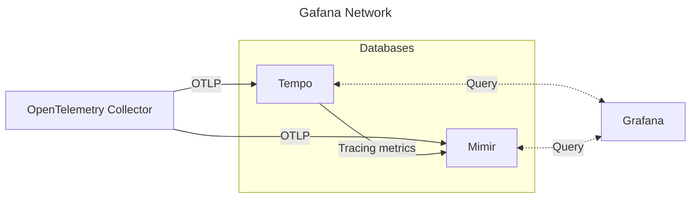

# Grafana Local

When spun up, this repository allows you to have a local stack of Grafana, Tempo and Mimir running aiding in the development of applications and services emitting OpenTelemetry traces and metrics.

## Getting Started

An [OpenTelemetry Collector](https://opentelemetry.io/docs/collector/) is spun up and can recieve `otlp` traces and metrics traces on the following endpoints:

- `opentelemetry-collector:4317` (gRPC)
- `opentelemetry-collector:4318` (http).

A setup of a rudimental traceprovider in Go could look like this.

```go
func CreateTraceProvider() (trace.TraceProvider, error) {
    exporterOpts := []otlptracegrpc.Option{
        otlptracegrpc.WithEndpoint("opentelemetry-collector:4317"),
        otlptracegrpc.WithInsecure(),
    }

    grcpExp, err := otlptracegrpc.New(context.TODO(), exporterOpts...)
    if err != nil {
        return nil, fmt.Errorf("creating OpenTelemetry gRPC exporter: %w", err)
    }

    resources := resource.NewWithAttributes(
        semconv.SchemaURL,
        semconv.ServiceNameKey.String("test-services"),
        semconv.ServiceVersionKey.String("v1.0.0"),
    )

    tp := sdktrace.NewTracerProvider(
        sdktrace.WithSampler(sdktrace.AlwaysSample()),
        sdktrace.WithBatcher(grcpExp),
        sdktrace.WithResource(resources),
    )

    return tp, nil
}
```

## Service diagram

The services run in a docker network called `grafanet`. All entrypoints for metrics should hit the `OpenTelemetry Collector` that then will propagate the data to the different datastores.


