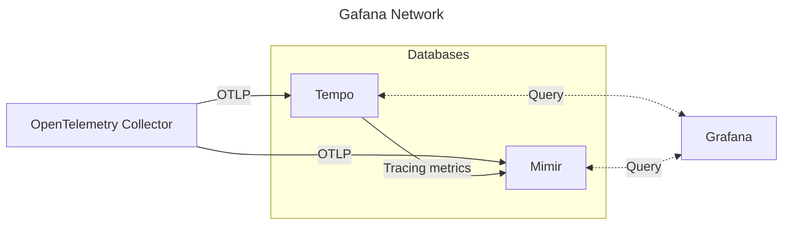

# Grafana Local

When spun up, this repository allows you to have a local stack of Grafana, Tempo and Mimir running aiding in the development of applications and services emitting OpenTelemetry traces and metrics.

## Getting Started

An [OpenTelemetry Collector](https://opentelemetry.io/docs/collector/) is spun up and can recieve `otlp` traces and metrics traces on the following endpoints:

- `opentelemetry-collector:4317` (gRPC)
- `opentelemetry-collector:4318` (http).

### Creating a trace provider

```go
func CreateTraceProvider(ctx context.Context) (trace.TraceProvider, error) {
    var (
        serviceName    string = "test-service"
        serviceVersion string = "v1.0.0"
    )

    exporterOpts := []otlptracegrpc.Option{
        otlptracegrpc.WithEndpoint("opentelemetry-collector:4317"),
        otlptracegrpc.WithInsecure(),
    }

    traceExporter, err := otlptracegrpc.New(ctx, exporterOpts...)
    if err != nil {
        return nil, err
    }

    resources := resource.NewWithAttributes(
        semconv.SchemaURL,
        semconv.ServiceNameKey.String(serviceName),
        semconv.ServiceVersionKey.String(serviceVersion),
    )

    traceProvider := sdktrace.NewTracerProvider(
        sdktrace.WithSampler(sdktrace.AlwaysSample()),
        sdktrace.WithBatcher(traceExporter),
        sdktrace.WithResource(resources),
    )

    propergator := propagation.NewCompositeTextMapPropagator(
        propagation.TraceContext{},
        propagation.Baggage{},
    )

    otel.SetTracerProvider(traceProvider)
    otel.SetTextMapPropagator(propergator)

    return traceProvider, nil
}
```

### Creating a meter provider

```go
func CreateMeterProvider(ctx context.Context) (metric.MeterProvider, error) {
    var (
        serviceName    string = "test-service"
        serviceVersion string = "v1.0.0"
    )

    exporterMeter := []otlpmetricgrpc.Option{
        otlpmetricgrpc.WithEndpoint("opentelemetry-collector:4317"),
        otlpmetricgrpc.WithInsecure(),
    }

    metricExporter, err := otlpmetricgrpc.New(ctx, exporterMeter...)
    if err != nil {
        return nil, err
    }

    reader := sdkmetric.NewPeriodicReader(metricExporter)

    resources := resource.NewWithAttributes(
        semconv.SchemaURL,
        semconv.ServiceNameKey.String(serviceName),
        semconv.ServiceVersionKey.String(serviceVersion),
    )

    meterProvider := sdkmetric.NewMeterProvider(
        sdkmetric.WithReader(reader),
        sdkmetric.WithResource(resources),
    )

    otel.SetMeterProvider(meterProvider)

    return meterProvider, nil
}
```

## Service diagram

The services run in a docker network called `grafanet`. All entrypoints for metrics should hit the `OpenTelemetry Collector` that then will propagate the data to the different datastores.


